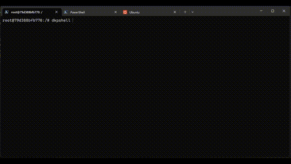

# dkpshell

**dkpshell** est un shell interactif conçu pour moderniser l’expérience des shells classiques comme Bash ou sh.
Il est destiné aux systèmes **Linux** et n’est pas compatible avec **Windows**.

La première version du projet a été développée en **Python**.
La version actuelle est une réécriture en **C++** visant de meilleures performances et une architecture plus robuste.


---

## Fonctionnalités

* Shell interactif
* Personnalisation du prompt
* Système d’alias intégré
* Thèmes pour modifier l’apparence
* Outils intégrés pour la configuration
* Détection de la branche Git

---

## Installation

### 1. Cloner le projet

```bash
git clone https://github.com/MJVhack/dkpshellV2
cd dkpshellV2
```

---

### 2. Compilation

Rendre le script exécutable :

```bash
chmod +x scripts/compile.sh
```

Compiler le projet :

```bash
./scripts/compile.sh
```

Lancer le shell :

```bash
./dkpshell.out --name root --addtopath --start
```
--name: nom (ou préfixe)
--addtopah: si il doit etre dans /usr/local/bin
--start: pour demarrer directement le script
---

### Alternative

Un binaire précompilé est disponible dans la section releases :

https://github.com/MJVhack/dkpshellV2/releases/tag/compiled

---

## Aperçu

Voici l’apparence du shell au démarrage :




Le préfixe correspond au prompt du shell, par exemple :

```
ICI@EDDKP:/#
```

Lorsque le shell n’est pas exécuté en **root**, la demande du **PATH** est ignorée.

---

## Commandes personnalisées

dkpshell inclut plusieurs commandes internes.

### dkpconfig

Gestion de la configuration du shell.

Option disponible :

```
-restartshell
```

---

### dkptool

Outils utilitaires pour le shell.

Fonction principale :

```
AddToPath
```

---

### dkptheme

Permet de changer le thème du shell.

Thèmes disponibles :

```
P1
P2
P3
P4
P5
```

---

### dkpalias

Permet d’ajouter des alias directement dans le shell.

---

### dkpinfo

Affiche les informations sur le shell et son environnement.

---

## Objectif du projet

dkpshell vise à proposer :

* un shell léger
* facilement personnalisable
* extensible
* simple à utiliser
